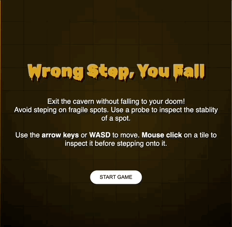

# trijam-171
Source code for Ashley's Trijam #171 entry. The theme is "Watch your step."  I like to add an additional constraint of only being able to use native HTML and JavaScript with no HTML5 canvas. 

[Trijam](https://itch.io/jam/trijam-171) is a weekly game jam where the goal is to create a game in under 3 hours of development time.

Total Dev Time: < 3 hours.  I was able to leverage some code from a previous Trijam. 

## Synopsis

**Wrong Step, You Fall** is a memory based game where you are stuck in a cave trying to safely find your way out. 

Select the wrong tile and you'll fall.

Use *arrow keys* or *WASD* to move your character around.  *Mouse click* to inspect a tile before stepping on it. Use this ability wisely. There is a limited number of times where an inspection can be used.



## Built With

* Visual Studio Code
* [Rubik Wet Paint Google Font](https://fonts.google.com/specimen/Rubik+Wet+Paint?category=Display&preview.text=Wrong%20Step,%20You%20Fall&preview.text_type=custom)

## Third Party Assets

* Nightmare_ambience_7_2_slow_loop..wav (megasfxpack)
* Knocking_on_the_door_1.wav (megasfxpack)
* Step_brick_23.wav (megasfxpack)
* Scream_5.wav (megasfxpack)
* metalDoor.wav (megasfxpack)
* Bone_Break_43.wav (megasfxpack)

## Project Setup

Run with local web server

```sh
python -m http.server 8000
```

or

```sh
python3 -m http.server 8000
```

## Maintainers

* [Ashley Grenon - @townsean](https://github.com/townsean)

## License (MIT)

MIT License

Copyright (c) 2022 Ashley Grenon

Permission is hereby granted, free of charge, to any person obtaining a copy of this software and associated documentation files (the "Software"), to deal in the Software without restriction, including without limitation the rights to use, copy, modify, merge, publish, distribute, sublicense, and/or sell copies of the Software, and to permit persons to whom the Software is furnished to do so, subject to the following conditions:

The above copyright notice and this permission notice shall be included in all copies or substantial portions of the Software.

THE SOFTWARE IS PROVIDED "AS IS", WITHOUT WARRANTY OF ANY KIND, EXPRESS OR IMPLIED, INCLUDING BUT NOT LIMITED TO THE WARRANTIES OF MERCHANTABILITY, FITNESS FOR A PARTICULAR PURPOSE AND NONINFRINGEMENT. IN NO EVENT SHALL THE AUTHORS OR COPYRIGHT HOLDERS BE LIABLE FOR ANY CLAIM, DAMAGES OR OTHER LIABILITY, WHETHER IN AN ACTION OF CONTRACT, TORT OR OTHERWISE, ARISING FROM, OUT OF OR IN CONNECTION WITH THE SOFTWARE OR THE USE OR OTHER DEALINGS IN THE SOFTWARE.
